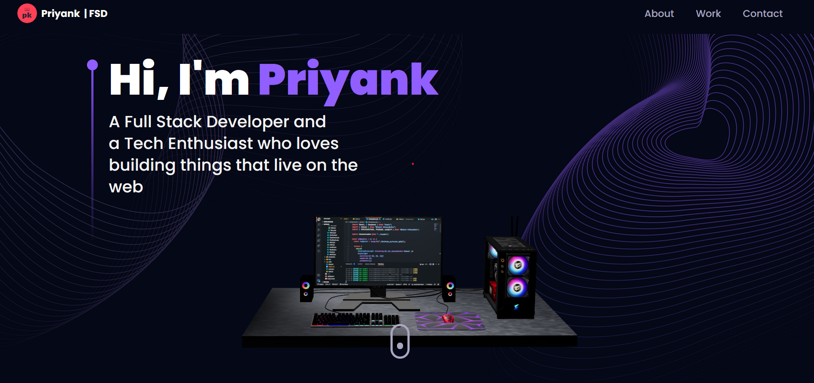

# My Three.js Portfolio Website

Welcome to my work-in-progress Three.js portfolio website! This project showcases my skills in 3D graphics and web development.

## Table of Contents

- [About](#about)
- [Works](#works)
- [Contact](#contact)

## About

This portfolio website is designed to display my projects, skills, and achievements in a visually appealing 3D environment created using the Three.js library. It serves as a showcase of my work as a developer and 3D artist.

## Works

Here, you can explore some of the exciting projects I've worked on. Each project is a unique combination of creativity and technical expertise.

## Contact

Feel free to get in touch with me if you have any questions, feedback, or opportunities for collaboration:

- Email: [priyank-khobragade@proton.me](mailto:priyank-khobragade@proton.me)
- LinkedIn: [Your LinkedIn Profile](https://www.linkedin.com/in/priyank-khobragade/)
- Twitter: [Your Twitter Profile](https://twitter.com/loeb___)

---

Thank you for visiting my portfolio website! I hope you enjoy exploring my work.
